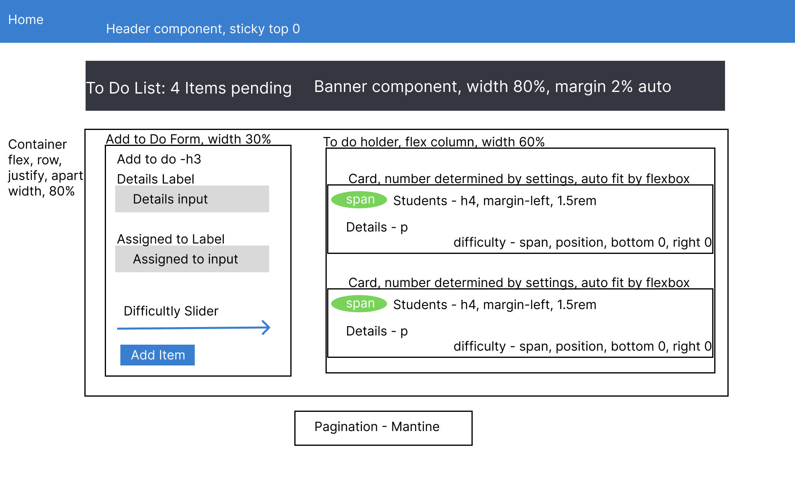
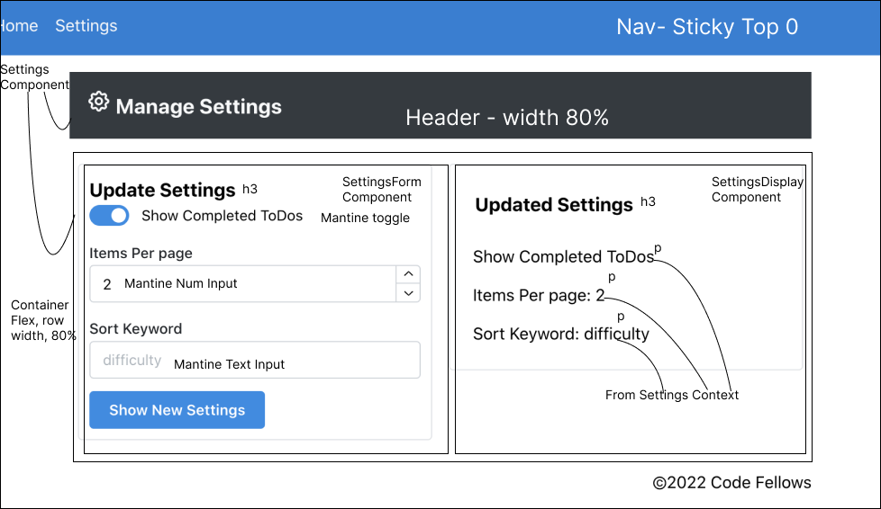

# Todo-App (Lab 31)

## Project: Todo-App

### Author: Tyler Bennett

### Problem Domain  

Refactor an existing To Do App with Mantine Components, React Context API, and Pagination. App is temporarily dark mode because I find it easier to stare at during development.

### Links and Resources

- [ci/cd](https://github.com/tyler-bennett52/todo-app/actions) (GitHub Actions)
- [Sandbox (main)](https://gqv8l0-3000.csb.app/)
- [Sandbox (context-settings)](https://n6mny7-3000.csb.app/)

### Setup

#### How to initialize/run your application (where applicable)

- npm i to install dependencies
- npm start to open page
- alternatively access the app at this url <https://gqv8l0-3000.csb.app/>

#### Features / Routes

No login currently, but To Dos can be created with details and difficulty level.

Custom hook 'useForm' designed to DRY up form handling, specifically handling change and submit events. Typically forms are handled in similar ways so to prevent rewriting code we can abstract out the logic into this custom hook.

Settings context is provided app-wide, but so far only consumed by Todo component where the core functionality of our app currently lives. Todo needs to know how many items to display, whether or not to display finished items, and if there is a non-standard sort order (difficulty). It uses this information from the settings context to determine how many pages there are to load for the Pagination component, and which items are display-worthy.

#### Tests

npm test

Unit tests for simple components and an integration test to test the more complicated ones (Todo, Pagination, List).

#### UML

Day 1 UML

Day 2 UML

#### Attribution

Built from starter code. Unit tests are mostly my own, but relied heavily on ChatGPT for app.test.jsx, specifically the renderWithContext function which is used in every test. Context test followed the format we used in class. List.test.js is my own logic, but chatGPT recommended the loop to test mulitple list items.

Additionally, I asked chatGPT for feedback on my ToDo form and it recommended this line `const incompleteItems = list.filter((todo) => !todo.complete);`. This is much shorter than what I had before. I almost always type my booleans in a more explicit manner (`todo.complete === false`), but this is way cleaner.
